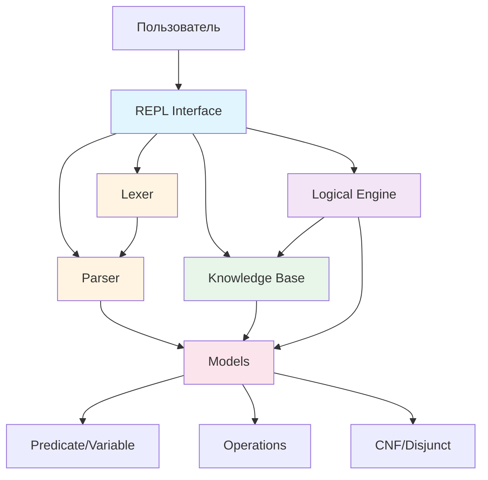
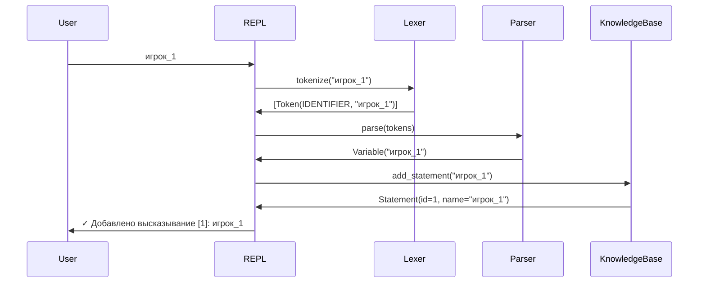
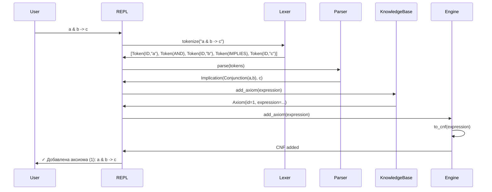
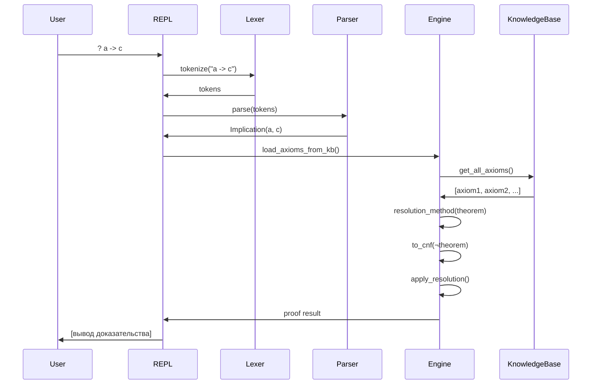
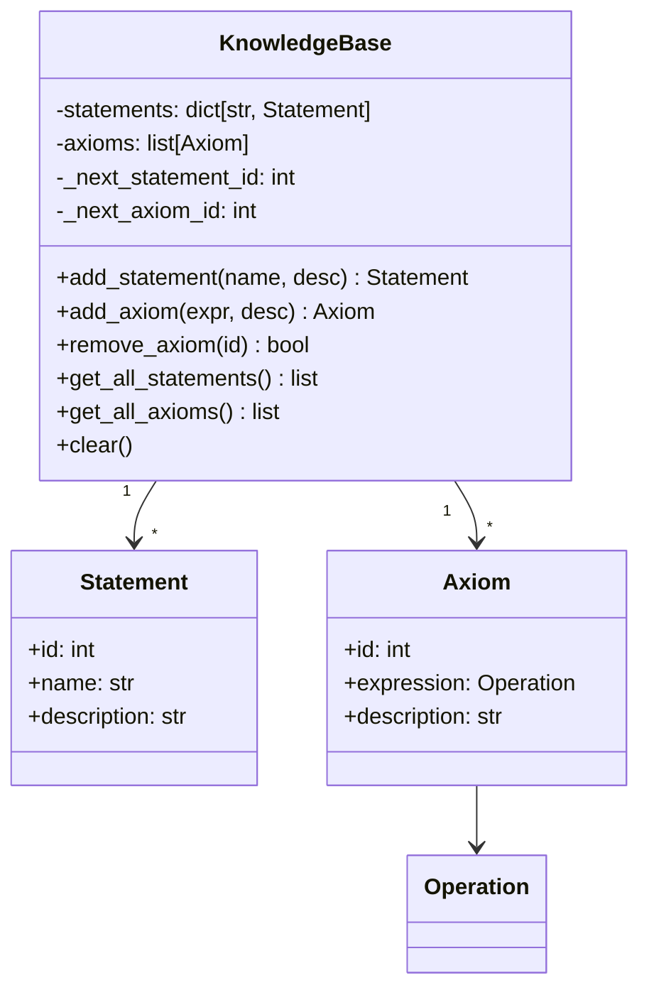
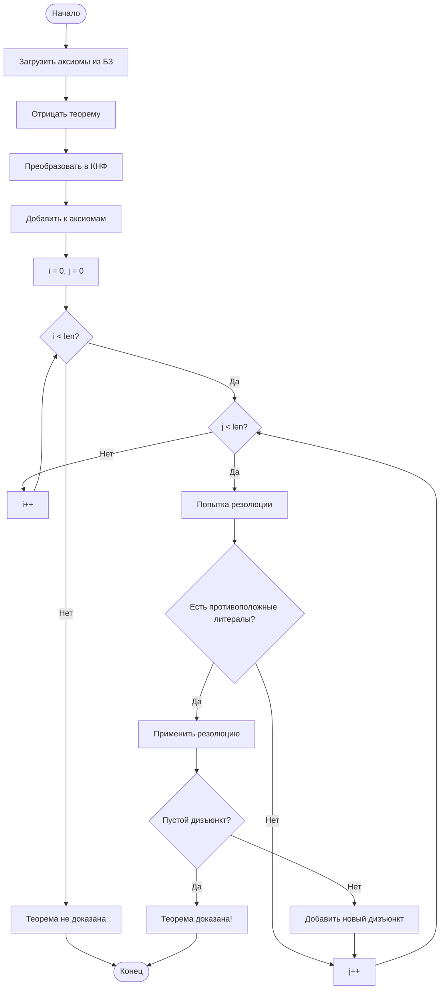
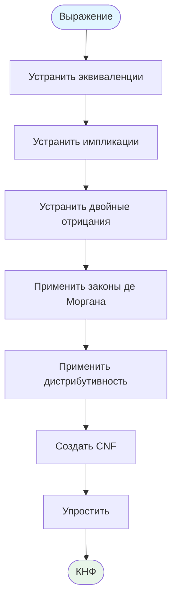
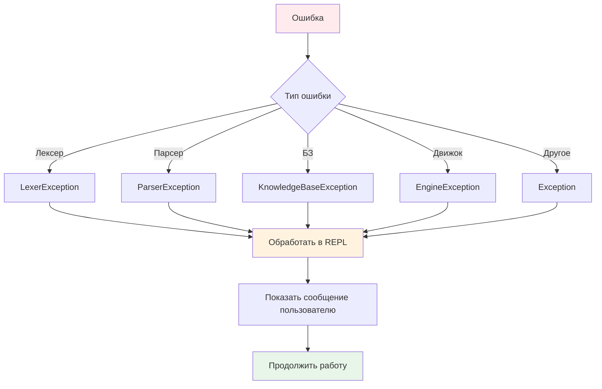

# Архитектура системы логического языка программирования

## Общая структура проекта

```
MunchkinLogicSystem/
├── models.py              # Модели данных (Operation, Predicate, CNF, etc.)
├── engine.py              # Логический движок (преобразования, резолюции)
├── lexer.py               # Лексический анализатор
├── parser.py              # Синтаксический анализатор (НОВЫЙ)
├── knowledge_base.py      # База знаний (НОВЫЙ)
├── exceptions.py          # Иерархия исключений (НОВЫЙ)
├── repl.py                # Консольный интерфейс (НОВЫЙ)
├── main.py                # Точка входа
├── demo.py                # Демонстрация работы (НОВЫЙ)
├── tests/
│   ├── test_lexer.py
│   ├── test_parser.py     # (НОВЫЙ)
│   ├── test_engine.py
│   └── test_kb.py         # (НОВЫЙ)
├── examples/
│   ├── situation1.shldn   # (НОВЫЙ)
│   ├── situation2.shldn   # (НОВЫЙ)
│   └── situation3.shldn   # (НОВЫЙ)
└── README.md
```

## Диаграмма компонентов



## Поток обработки данных

### 1. Обработка высказывания



### 2. Обработка аксиомы



### 3. Проверка теоремы



## Архитектура парсера

### Приоритет операторов (от низкого к высокому)

```
1. <->  (эквиваленция)      - parse_equivalence()
2. ->   (импликация)         - parse_implication()
3. | +  (дизъюнкция)         - parse_disjunction()
4. & *  (конъюнкция)         - parse_conjunction()
5. !    (отрицание)          - parse_negation()
6. ()   (скобки)             - parse_primary()
7. id   (идентификаторы)     - parse_primary()
```

### Грамматика языка (EBNF)

```ebnf
expression     = equivalence ;
equivalence    = implication { "<->" implication } ;
implication    = disjunction [ "->" disjunction ] ;
disjunction    = conjunction { ("|" | "+") conjunction } ;
conjunction    = negation { ("&" | "*") negation } ;
negation       = "!" negation | primary ;
primary        = identifier | "(" expression ")" | string ;
identifier     = letter { letter | digit | "_" } ;
string         = '"' { any_char } '"' ;
```

## Структура базы знаний



## Алгоритм метода резолюций



## Преобразование в КНФ



## Обработка ошибок



## Интеграция компонентов

### LogicalEngine + KnowledgeBase

```python
class LogicalEngine:
    def __init__(self, knowledge_base: KnowledgeBase = None):
        self.kb = knowledge_base or KnowledgeBase()
        self.axioms: list[Disjunct] = []
    
    def load_axioms_from_kb(self):
        """Синхронизация с базой знаний"""
        self.axioms.clear()
        for axiom in self.kb.get_all_axioms():
            cnf = self.to_cnf(axiom.expression)
            if cnf.children:
                self.axioms.extend(cnf.children)
```

### REPL + все компоненты

```python
class REPL:
    def __init__(self):
        self.kb = KnowledgeBase()
        self.engine = LogicalEngine(self.kb)
        self.lexer = Lexer()
        self.parser = Parser([])
    
    def process_line(self, line: str):
        # 1. Лексический анализ
        tokens = self.lexer.tokenize_line(line)
        
        # 2. Синтаксический анализ
        self.parser.tokens = tokens
        expression = self.parser.parse()
        
        # 3. Обработка в зависимости от типа
        if is_theorem:
            self.engine.resolution_method(expression)
        elif is_axiom:
            self.kb.add_axiom(expression)
            self.engine.add_axiom(expression)
        else:
            self.kb.add_statement(expression.name)
```

## Расширяемость системы

### Добавление новых операторов

1. Добавить токен в [`TokenType`](lexer.py:10)
2. Добавить обработку в [`Lexer.tokenize_line()`](lexer.py:39)
3. Добавить класс операции в [`models.py`](models.py)
4. Добавить метод парсинга в `Parser`
5. Добавить преобразование в [`LogicalEngine`](engine.py:20)

### Добавление новых команд

1. Добавить метод `cmd_<название>()` в `REPL`
2. Добавить обработку в `REPL.process_line()`
3. Обновить справку в `cmd_help()`

### Добавление новых правил вывода

1. Создать метод в [`LogicalEngine`](engine.py:20)
2. Добавить вызов в `REPL.process_theorem()`
3. Документировать в справке

## Производительность

### Оптимизации

1. **Кэширование КНФ**: Сохранять преобразованные выражения
2. **Индексация дизъюнктов**: Быстрый поиск противоположных литералов
3. **Ранняя остановка**: Прекращать резолюцию при нахождении пустого дизъюнкта
4. **Упрощение на лету**: Удалять тавтологии сразу

### Ограничения

- Максимальная длина выражения: не ограничена
- Максимальное количество аксиом: не ограничено
- Глубина вложенности скобок: не ограничена
- Время работы резолюции: экспоненциальное в худшем случае

## Тестирование

### Модульные тесты

```python
# test_lexer.py - тестирование лексера
# test_parser.py - тестирование парсера
# test_engine.py - тестирование движка
# test_kb.py - тестирование базы знаний
# test_integration.py - интеграционные тесты
```

### Покрытие тестами

- Лексер: все типы токенов, ошибки
- Парсер: все операторы, приоритеты, ошибки
- Движок: все преобразования, резолюции
- База знаний: CRUD операции
- REPL: все команды

## Безопасность

### Обработка ввода

- Валидация всех входных данных
- Защита от бесконечных циклов
- Ограничение глубины рекурсии
- Обработка некорректных файлов

### Обработка ошибок

- Все исключения перехватываются
- Понятные сообщения об ошибках
- Логирование критических ошибок
- Graceful degradation