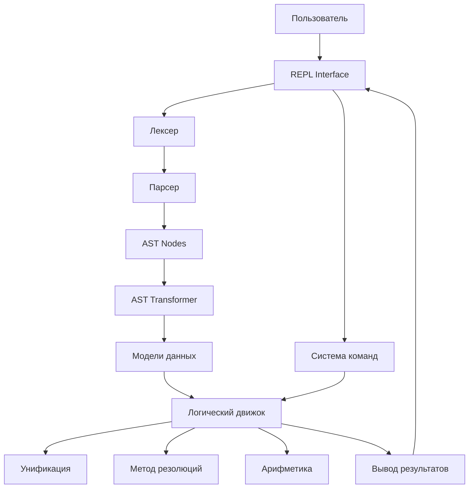
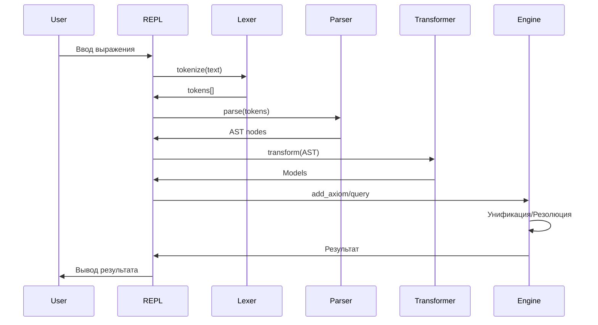
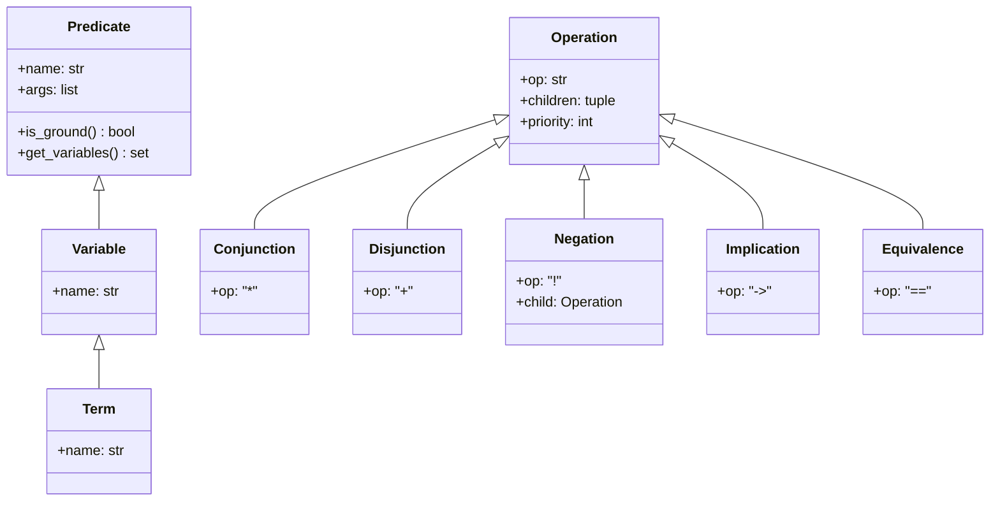
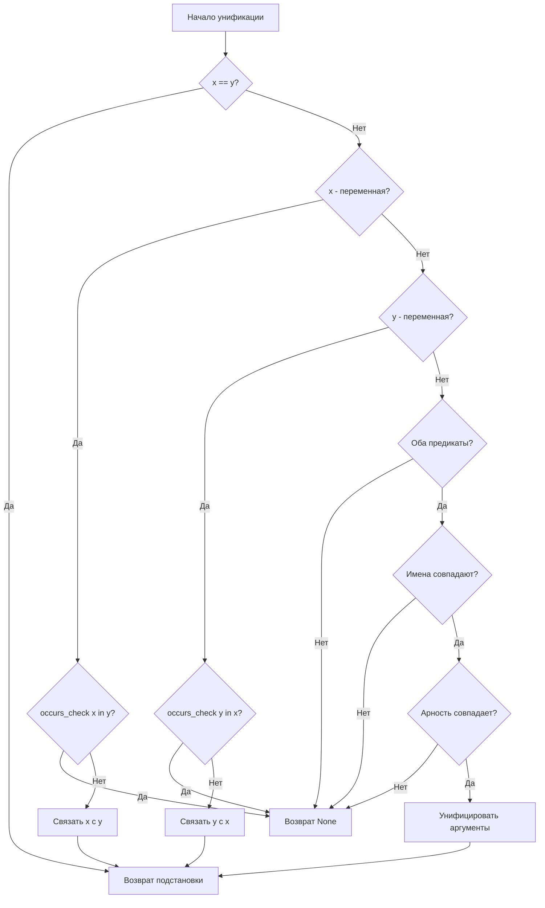

# План разработки логического языка SHLDN (Часть 3)

## Фаза 12: Архитектура и диаграммы

### 12.1 Общая архитектура системы



### 12.2 Поток обработки выражения



### 12.3 Структура классов моделей



### 12.4 Процесс унификации



---

## Фаза 13: Приоритеты разработки

### 13.1 Критический путь (MVP)

**Этап 1: Базовая функциональность (2-3 недели)**
1. Расширение лексера для всех токенов
2. Базовый парсер для высказываний и аксиом
3. Интеграция с существующим движком
4. Простой REPL

**Этап 2: Предикаты (2-3 недели)**
5. Поддержка предикатов с аргументами
6. Базовая унификация
7. Запросы с переменными

**Этап 3: Полная функциональность (2-3 недели)**
8. Арифметические операции
9. Система команд
10. Обработка ошибок

### 13.2 Дополнительные возможности

**Этап 4: Улучшения (1-2 недели)**
11. Оптимизация производительности
12. Расширенная диагностика
13. Подсветка синтаксиса

**Этап 5: Документация и тесты (1-2 недели)**
14. Полное покрытие тестами
15. Документация API
16. Примеры использования

---

## Фаза 14: Детальный план реализации

### 14.1 Неделя 1-2: Лексер и базовый парсер

**День 1-3: Расширение лексера**
- [ ] Добавить все типы токенов в [`TokenType`](../lexer.py:10)
- [ ] Реализовать `skip_whitespace()`, `skip_comment()`
- [ ] Реализовать `parse_number()`, `parse_string()`
- [ ] Реализовать `parse_identifier_or_variable()`
- [ ] Реализовать `parse_operator()` с поддержкой многосимвольных операторов
- [ ] Добавить обработку ошибок с позицией
- [ ] Написать тесты для лексера

**День 4-7: Базовый парсер**
- [ ] Создать `parser.py` с классами AST узлов
- [ ] Реализовать `parse_expression()` и методы для каждого уровня грамматики
- [ ] Реализовать `parse_predicate()` для предикатов с аргументами
- [ ] Добавить обработку ошибок парсера
- [ ] Написать тесты для парсера

**День 8-10: AST Transformer**
- [ ] Создать `ast_transformer.py`
- [ ] Реализовать преобразование AST узлов в модели из [`models.py`](../models.py:1)
- [ ] Интегрировать с существующим [`LogicalEngine`](../engine.py:20)
- [ ] Написать тесты для трансформера

### 14.2 Неделя 3-4: Предикаты и унификация

**День 11-14: Расширение моделей**
- [ ] Расширить класс [`Predicate`](../models.py:11) для поддержки аргументов
- [ ] Улучшить классы [`Variable`](../models.py:50) и [`Term`](../models.py:55)
- [ ] Добавить методы `is_ground()`, `get_variables()`
- [ ] Реализовать `__eq__()` и `__hash__()` для корректного сравнения
- [ ] Написать тесты для моделей

**День 15-20: Унификация**
- [ ] Создать `unification.py`
- [ ] Реализовать класс `Substitution`
- [ ] Реализовать функцию `occurs_check()`
- [ ] Реализовать алгоритм унификации Робинсона `unify()`
- [ ] Реализовать `unify_list()` для списков предикатов
- [ ] Написать тесты для унификации

**День 21-24: Интеграция в движок**
- [ ] Добавить `add_fact()` в [`LogicalEngine`](../engine.py:20)
- [ ] Реализовать `query()` с унификацией
- [ ] Реализовать `backward_chaining()`
- [ ] Реализовать `prove_conjunction()`
- [ ] Написать тесты для запросов

### 14.3 Неделя 5-6: Арифметика и команды

**День 25-28: Арифметические операции**
- [ ] Добавить классы `Addition`, `Subtraction`, `Multiplication`, `Division` в [`models.py`](../models.py:1)
- [ ] Добавить класс `Comparison` для операторов сравнения
- [ ] Реализовать `evaluate_arithmetic()` в `unification.py`
- [ ] Реализовать `evaluate_comparison()`
- [ ] Интегрировать арифметику в правила
- [ ] Написать тесты для арифметики

**День 29-32: Система команд**
- [ ] Создать `commands.py`
- [ ] Реализовать `LoadCommand`, `GetAxiomsCommand`, `GetFactsCommand`
- [ ] Реализовать `RemoveCommand`, `HelpCommand`
- [ ] Создать `CommandRegistry`
- [ ] Написать тесты для команд

**День 33-36: REPL интерфейс**
- [ ] Создать `repl.py`
- [ ] Реализовать класс `REPL` с методами `read_input()`, `eval_statement()`, `process_line()`
- [ ] Добавить поддержку выполнения файлов
- [ ] Обновить [`main.py`](../main.py:1)
- [ ] Написать интеграционные тесты

### 14.4 Неделя 7-8: Доработка и документация

**День 37-40: Обработка ошибок**
- [ ] Создать `exceptions.py` с иерархией исключений
- [ ] Добавить валидацию во все компоненты
- [ ] Улучшить сообщения об ошибках
- [ ] Добавить отладочный режим

**День 41-44: Тестирование**
- [ ] Написать тесты для всех модулей
- [ ] Добавить интеграционные тесты
- [ ] Проверить покрытие кода тестами (цель: >80%)
- [ ] Исправить найденные баги

**День 45-50: Документация**
- [ ] Написать `README.md` с примерами
- [ ] Создать `language_reference.md`
- [ ] Написать `examples.md` с практическими примерами
- [ ] Создать `api_reference.md`
- [ ] Добавить комментарии в код

---

## Фаза 15: Проверочный список функциональности

### 15.1 Исчисление высказываний (ИВ)

- [ ] **Высказывания**: простые идентификаторы
- [ ] **Логические операторы**:
  - [ ] Конъюнкция (&, *)
  - [ ] Дизъюнкция (|, +)
  - [ ] Отрицание (!)
  - [ ] Импликация (->)
  - [ ] Эквиваленция (==, <->)
- [ ] **Аксиомы**: правила вида `условие -> следствие`
- [ ] **Теоремы**: запросы с `?`
- [ ] **Метод резолюций**: доказательство теорем
- [ ] **КНФ**: преобразование в конъюнктивную нормальную форму
- [ ] **Законы Булевой алгебры**:
  - [ ] Законы де Моргана
  - [ ] Удаление импликаций
  - [ ] Удаление эквиваленций
  - [ ] Удаление двойных отрицаний

### 15.2 Исчисление предикатов (ИП)

- [ ] **Предикаты**: `имя(аргументы)`
- [ ] **Термы**: переменные с большой буквы (X, Y, Z)
- [ ] **Унификация**: алгоритм Робинсона
- [ ] **Подстановка**: связывание переменных
- [ ] **Запросы с переменными**: `? уровень(игрок(X), 2)`
- [ ] **Факты**: предикаты без условий
- [ ] **Правила**: предикаты с условиями
- [ ] **Обратный вывод**: backward chaining
- [ ] **Вычисление**: evaluation с подстановками

### 15.3 Арифметика

- [ ] **Операции**: +, -, *, /
- [ ] **Сравнения**: >, <, >=, <=, ==, !=
- [ ] **Вычисление в правилах**: `Y + Z`
- [ ] **Вычисление в запросах**: `Sx > Sm`
- [ ] **Обработка ошибок**: деление на ноль

### 15.4 Система команд

- [ ] **load**: загрузка файла
- [ ] **get axioms**: вывод всех аксиом
- [ ] **get facts**: вывод всех фактов
- [ ] **remove**: удаление аксиомы по номеру
- [ ] **help**: справка по языку
- [ ] **exit**: выход из программы

### 15.5 Дополнительно

- [ ] **Комментарии**: `//` и `/* */`
- [ ] **Строковые литералы**: `"текст"`
- [ ] **Обработка ошибок**: информативные сообщения
- [ ] **REPL**: интерактивный режим
- [ ] **Выполнение файлов**: `python main.py example.shldn`
- [ ] **Тесты**: покрытие >80%
- [ ] **Документация**: полная справка

---

## Фаза 16: Примеры использования

### 16.1 Пример 1: Простая логика (ИВ)

```shldn
// Факты
игрок_1_уровень_10
игрок_1_воин

// Правила
игрок_1_уровень_10 & игрок_1_воин -> игрок_1_сильный
игрок_1_сильный -> игрок_1_победитель

// Запрос
? игрок_1_победитель
```

**Ожидаемый результат:**
```
Доказательство: игрок_1_победитель
============================================================
(1) !игрок_1_уровень_10 + !игрок_1_воин + игрок_1_сильный
(2) !игрок_1_сильный + игрок_1_победитель
Новые дизъюнкты
(3) !игрок_1_победитель

(1) !игрок_1_уровень_10 + !игрок_1_воин + игрок_1_сильный |
                                                            |--> (4) !игрок_1_уровень_10 + !игрок_1_воин + игрок_1_победитель
(2) !игрок_1_сильный + игрок_1_победитель                  |

...

Пустой дизъюнкт - теорема доказана.
```

### 16.2 Пример 2: Предикаты и унификация (ИП)

```shldn
// Факты
уровень(игрок(1), 10)
уровень(игрок(2), 5)
класс(игрок(1), воин)
класс(игрок(2), маг)

// Запросы
? уровень(игрок(X), 10)
? класс(игрок(1), Y)
```

**Ожидаемый результат:**
```
Запрос: уровень(игрок(X), 10)
Найдено решений: 1

Решение 1:
  X = 1

Запрос: класс(игрок(1), Y)
Найдено решений: 1

Решение 1:
  Y = воин
```

### 16.3 Пример 3: Арифметика

```shldn
// Факты
уровень(игрок(1), 5)
сила(игрок(1), 10)
уровень(монстр(гоблин), 3)

// Правило с арифметикой
уровень(игрок(X), Y) & сила(игрок(X), Z) -> боевая_сила(игрок(X), Y + Z)

// Правило со сравнением
боевая_сила(игрок(X), Sx) & уровень(монстр(M), Sm) & (Sx > Sm) -> победа(игрок(X), монстр(M))

// Запросы
? боевая_сила(игрок(1), S)
? победа(игрок(1), монстр(гоблин))
```

**Ожидаемый результат:**
```
Запрос: боевая_сила(игрок(1), S)
Найдено решений: 1

Решение 1:
  S = 15

Запрос: победа(игрок(1), монстр(гоблин))
Найдено решений: 1

Решение 1:
  Да (без подстановок)
```

---

## Фаза 17: Метрики и критерии успеха

### 17.1 Функциональные метрики

- ✅ Поддержка всех конструкций из [`example.shldn`](../example.shldn:1)
- ✅ Корректная работа метода резолюций
- ✅ Унификация работает для всех случаев
- ✅ Арифметические операции вычисляются правильно
- ✅ Все команды работают корректно

### 17.2 Качественные метрики

- **Покрытие тестами**: >80%
- **Производительность**: обработка 1000 фактов <1 сек
- **Обработка ошибок**: информативные сообщения для всех ошибок
- **Документация**: полное описание всех возможностей
- **Примеры**: минимум 10 рабочих примеров

### 17.3 Критерии приёмки

**Практическая работа №1 (ИВ):**
- [ ] Реализован лексер и парсер
- [ ] Поддержка операций алгебры логики
- [ ] База знаний (высказывания и аксиомы)
- [ ] Метод резолюций работает
- [ ] Моделирование 3 проблемных ситуаций
- [ ] Функция help реализована

**Практическая работа №2 (ИП):**
- [ ] Поддержка предикатов и термов
- [ ] Унификация реализована
- [ ] Правила вывода с кванторами
- [ ] Преобразование БЗ из ИВ в ИП
- [ ] Моделирование 3 проблемных ситуаций
- [ ] Сравнение с результатами ИВ

---

## Итоговое резюме

### Что будет реализовано

1. **Полнофункциональный лексер** с поддержкой всех конструкций языка
2. **Рекурсивный парсер** для построения AST
3. **Расширенные модели данных** для предикатов, термов и арифметики
4. **Алгоритм унификации Робинсона** для работы с переменными
5. **Метод резолюций** для доказательства теорем
6. **Обратный вывод** (backward chaining) для запросов
7. **Арифметические операции** и операторы сравнения
8. **Система команд** для управления базой знаний
9. **REPL-интерфейс** для интерактивной работы
10. **Обработка ошибок** с информативными сообщениями
11. **Полное покрытие тестами** всех компонентов
12. **Подробная документация** с примерами

### Структура проекта

```
MunchkinLogicSystem/
├── lexer.py              # Лексический анализатор
├── parser.py             # Синтаксический анализатор
├── ast_transformer.py    # Преобразование AST в модели
├── models.py             # Модели данных
├── engine.py             # Логический движок
├── unification.py        # Алгоритм унификации
├── commands.py           # Система команд
├── repl.py               # REPL интерфейс
├── exceptions.py         # Иерархия исключений
├── main.py               # Точка входа
├── example.shldn         # Примеры
├── docs/                 # Документация
│   ├── development_plan.md
│   ├── language_reference.md
│   ├── examples.md
│   └── api_reference.md
└── tests/                # Тесты
    ├── test_lexer.py
    ├── test_parser.py
    ├── test_unification.py
    ├── test_engine.py
    ├── test_arithmetic.py
    ├── test_commands.py
    └── test_integration.py
```

### Временные оценки

- **MVP (базовая функциональность)**: 3-4 недели
- **Полная функциональность**: 6-8 недель
- **Тестирование и документация**: 2 недели
- **Итого**: 8-10 недель

### Следующие шаги

1. Начать с расширения лексера (Фаза 1)
2. Параллельно проектировать структуру парсера
3. Постепенно добавлять функциональность
4. Писать тесты для каждого компонента
5. Интегрировать все части в единую систему
6. Провести финальное тестирование
7. Написать документацию

---

## Приложение: Полезные ссылки

### Теоретические основы

- Алгоритм унификации Робинсона
- Метод резолюций в логике первого порядка
- Обратный вывод (backward chaining)
- Преобразование в КНФ
- Законы Булевой алгебры

### Инструменты разработки

- Python 3.11+
- pytest для тестирования
- mypy для проверки типов
- black для форматирования кода
- pylint для статического анализа

### Примеры реализаций

- Prolog - классический язык логического программирования
- miniKanren - встраиваемый язык логического программирования
- PyDatalog - логическое программирование в Python